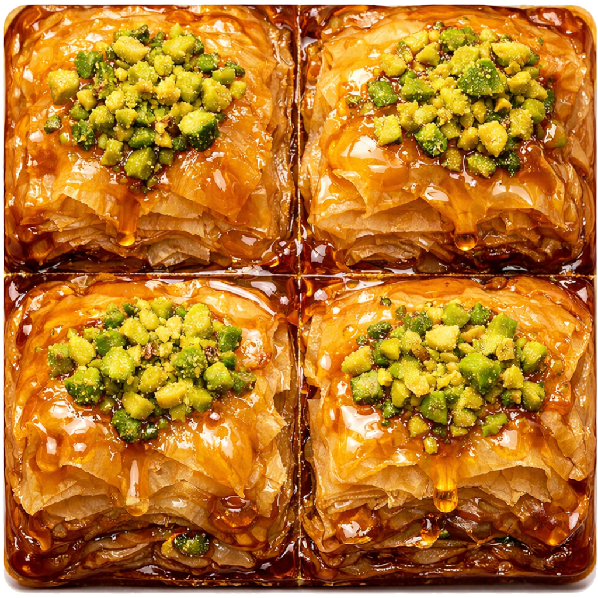

<div align="center">

  <br>
  
  <br>
  <br>

# &Lambda;&Alpha;&Beta;&Alpha; WM

### *&laquo; A tiling window manager, layered with care &raquo;*

**Fork of [GlazeWM](https://github.com/glzr-io/glazewm) &mdash; built for Windows on ARM, shaped by baklava and ambition.**

</div>

---

## What is this?

**LavaWM** (or &Lambda;&Alpha;&Beta;&Alpha;, if you're feeling Mediterranean) is a keyboard-driven tiling window manager for Windows, forked from the excellent [GlazeWM v3](https://github.com/glzr-io/glazewm). It inherits all the golden, flaky layers of GlazeWM and adds a few of its own:

- Ghost window cleanup (`wm-cleanup-windows`) &mdash; manually sweep away stale windows
- Fullscreen oscillation fix &mdash; stops RDP and other apps from fighting the WM in a rapid fullscreen/floating loop
- Windows on ARM (aarch64) first-class build support
- Can run side-by-side with a stock GlazeWM installation

### Key features (inherited from GlazeWM)

- Simple YAML configuration
- Multi-monitor support
- Customizable rules for specific windows
- Integration with [Zebar](https://github.com/glzr-io/zebar) as a status bar
- Binding modes, window effects, and more

## Full Disclosure

This project is managed largely by [Claude Code](https://claude.com/claude-code) (Anthropic's CLI agent). A human ([@jack-work](https://github.com/jack-work)) steers the ship, reviews the output, and eats the baklava &mdash; but the bulk of the code changes, architecture exploration, bug investigation, and even this README were produced by an AI pair-programming session.

**The author has so much baklava he needs help eating it all.** That means:

- PRs are welcome and appreciated
- If you want to understand how something works, open an issue &mdash; teaching is half the fun
- If a dependency develops or something breaks, extra hands make light work
- If the WM does something weird, it might be the AI's fault. File a bug.

## Getting Started

### Build from source

You'll need the Rust toolchain (nightly recommended for ARM targets):

```sh
git clone https://github.com/jack-work/lavawm.git
cd lavawm
cargo build --release
```

Binaries land in `target/release/`:
- `lavawm.exe` &mdash; the window manager
- `lavawm-cli.exe` &mdash; CLI client for commands/queries
- `lavawm-watcher.exe` &mdash; auto-restart watcher

### Run it

```sh
# Start the WM (generates default config on first run)
lavawm start

# Or with a custom config
lavawm start --config="C:\path\to\config.yaml"
```

Config lives at `%userprofile%\.glzr\lavawm\config.yaml` by default, or set `LAVAWM_CONFIG_PATH`.

### Coexistence with GlazeWM

LavaWM uses a separate config directory (`~/.glzr/lavawm/`), a separate single-instance mutex, and renamed binaries. You can have both installed &mdash; just don't run them at the same time (they share IPC port 6123 for Zebar compatibility).

## Default Keybindings

On first launch, a default config is generated. Here's the cheat sheet:


## Fork It

Seriously &mdash; **fork this repo and try modifying it yourself.** The codebase is well-structured (thanks to the upstream GlazeWM team), and Claude Code can help you navigate it. Some ideas:

- Add your own WM commands
- Tweak the tiling algorithm
- Build integrations with your favorite tools
- Fix that one window that never tiles right

If you make something cool, changes are always appreciated upstream (to me). Open a PR at [jack-work/lavawm](https://github.com/jack-work/lavawm) and let's make it better together.

## Configuration

LavaWM uses the same YAML config format as GlazeWM v3. See the [upstream config documentation](https://github.com/glzr-io/glazewm#config-documentation) for the full reference, or check the [sample config](./resources/assets/sample-config.yaml).

Quick reference of LavaWM-specific commands:

| Command | Description |
|---------|-------------|
| `wm-cleanup-windows` | Remove ghost windows (invalid HWNDs) from the tree |
| `wm-inject-ghost` | Debug: inject a fake ghost for testing cleanup |

## Known Issues

- **Fullscreen &rarr; minimize loop**: Some windows (especially RDP clients) can oscillate between fullscreen and floating states. A per-window cooldown mitigates this, but edge cases remain. See upstream issues [#1070](https://github.com/glzr-io/glazewm/issues/1070), [#906](https://github.com/glzr-io/glazewm/issues/906).
- **Toggle fullscreen sometimes minimizes**: If a window was minimized before going fullscreen, `toggle-fullscreen` may not restore correctly. The upstream fix (PR [#1071](https://github.com/glzr-io/glazewm/pull/1071)) is included, but some edge cases persist.

## License

This project is licensed under **GPL-3.0**, same as the upstream GlazeWM. See [LICENSE](./LICENSE) for details.

You are free to fork, modify, and redistribute &mdash; but derivative works must also be GPL-3.0 and source must be made available.

## Acknowledgments

- [GlazeWM](https://github.com/glzr-io/glazewm) by [glzr-io](https://github.com/glzr-io) &mdash; the foundation this is built on
- [i3wm](https://i3wm.org/) &mdash; the original inspiration
- [Zebar](https://github.com/glzr-io/zebar) &mdash; the status bar that ties it all together
- [Claude Code](https://claude.com/claude-code) &mdash; the AI that wrote most of this

---

<div align="center">

*Baked with pistachios and honey by [@jack-work](https://github.com/jack-work)*

*&Lambda;&Alpha;&Beta;&Alpha; &mdash; layer by layer*

</div>
